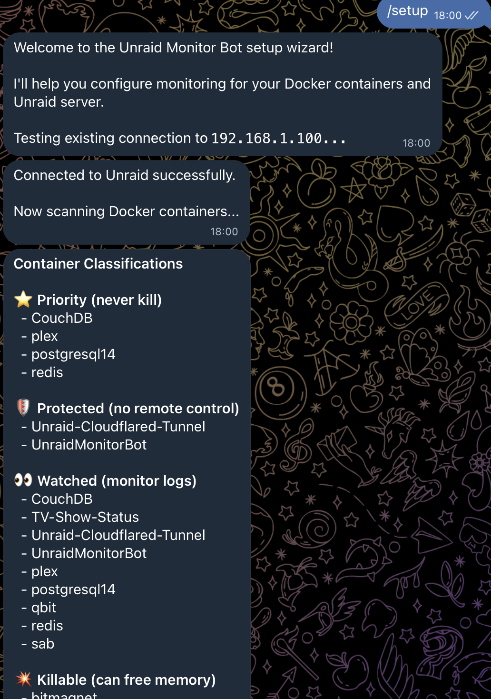
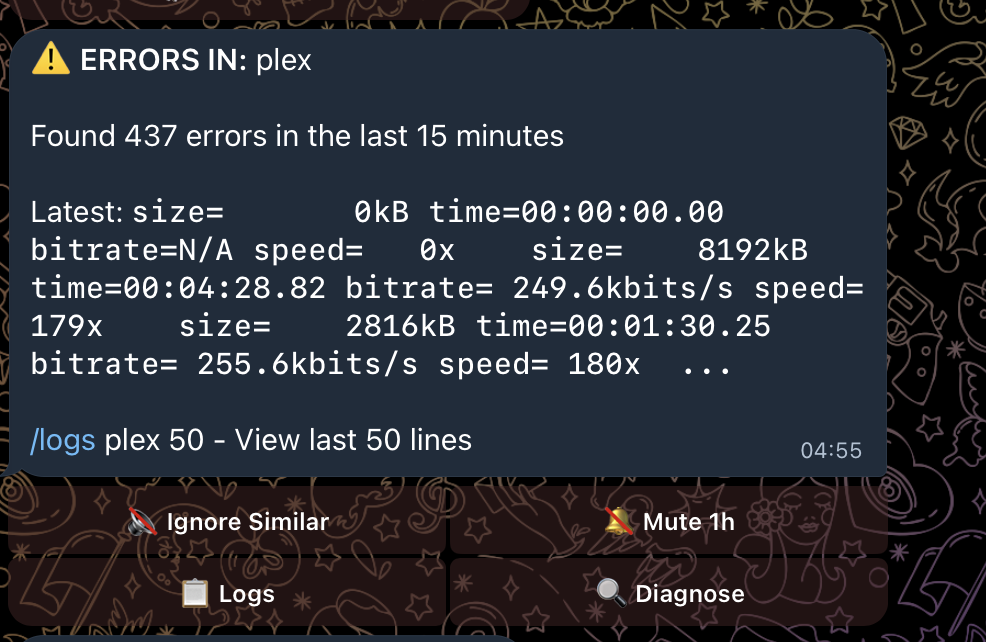
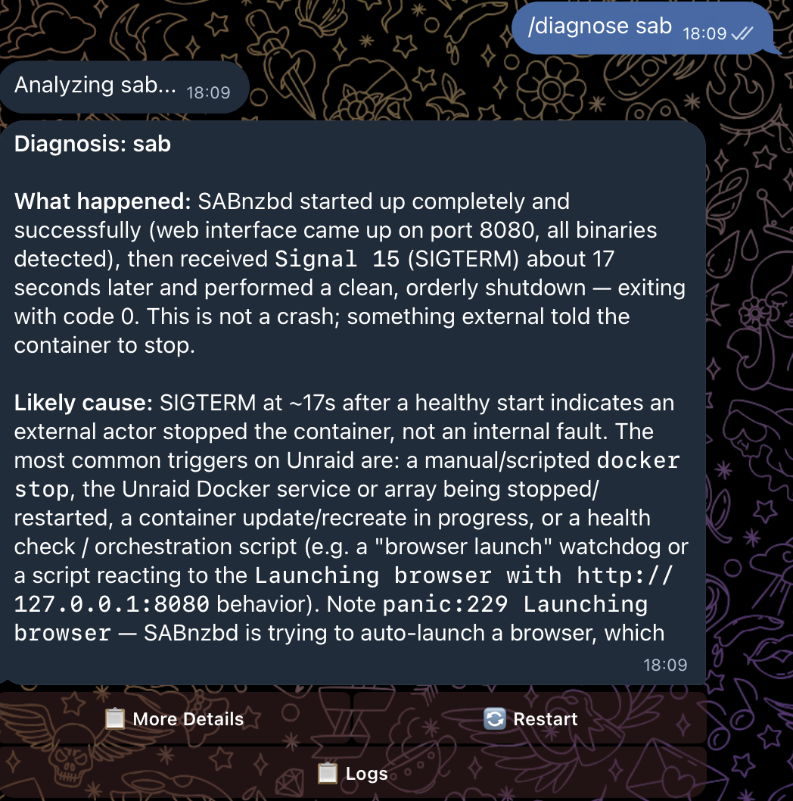
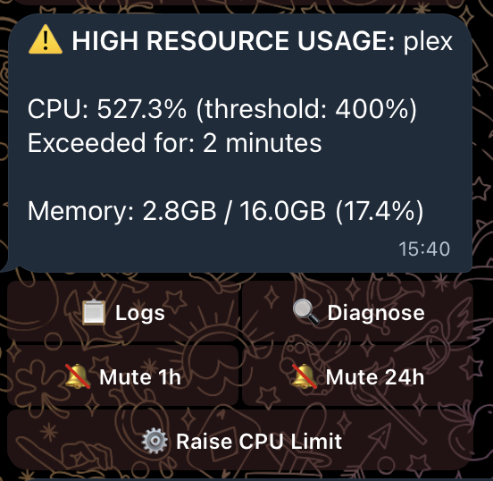
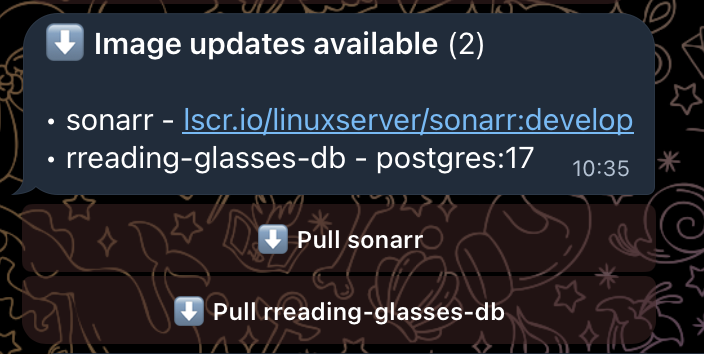
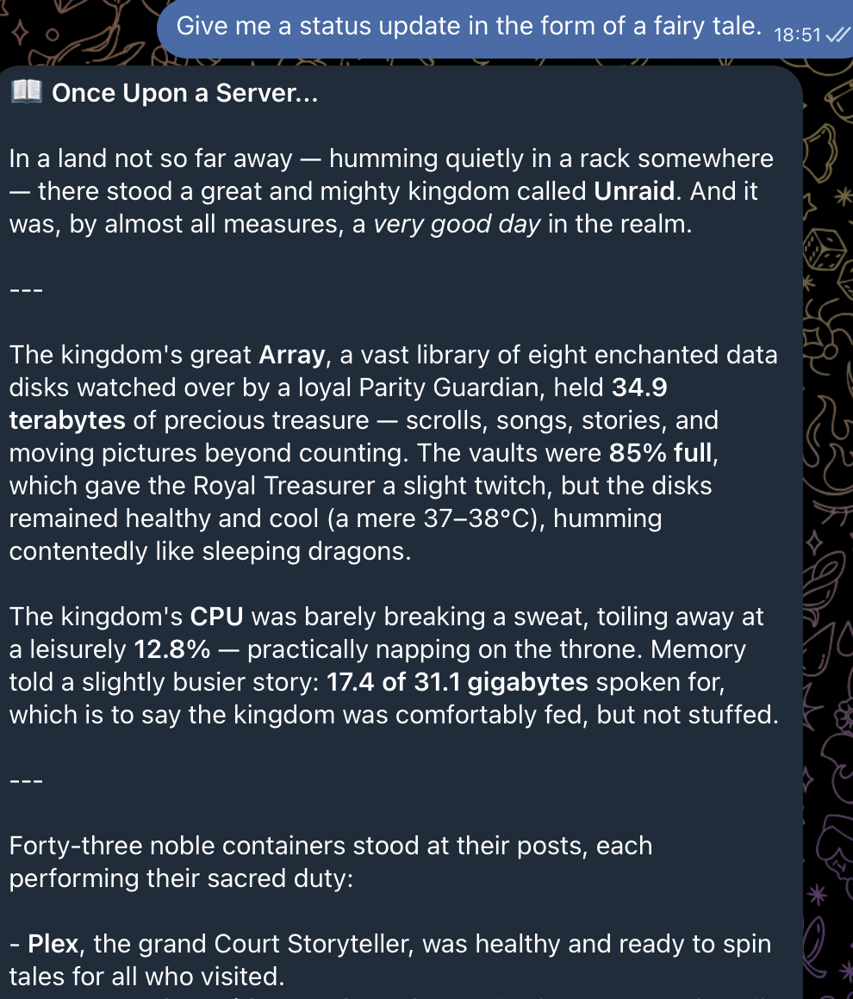
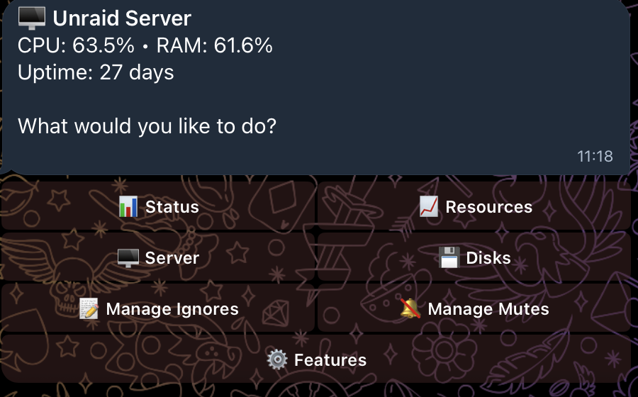
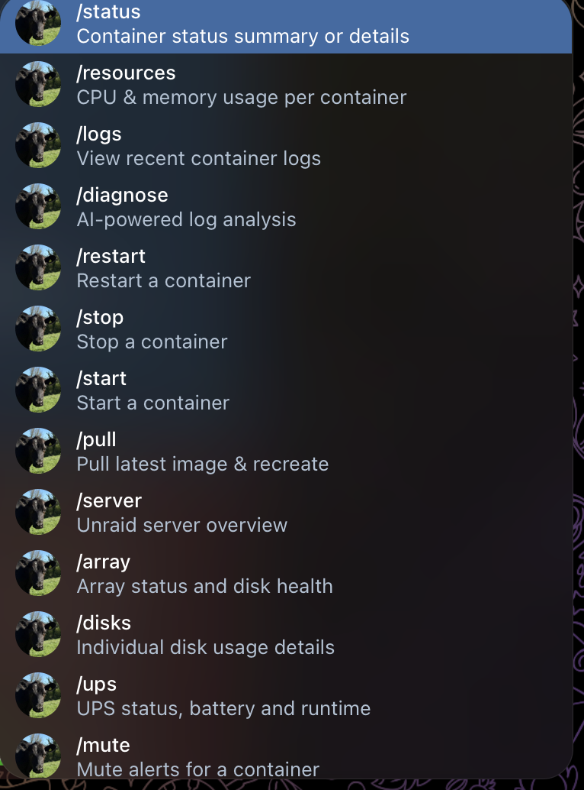

# UnraidMonitor

A Telegram bot for monitoring Docker containers and Unraid servers. Get real-time alerts, check container status, view logs, and control containers - all from Telegram.

**[scratch-it.co.uk/unraidmonitorbot](https://scratch-it.co.uk/unraidmonitorbot)** has the illustrated tour. This README is the reference.

## Features

- **Interactive Setup Wizard** - Guided first-run setup via Telegram with auto-classification of containers
- **Container Monitoring** - Status, health checks, crash detection, and recovery notifications
- **Resource Alerts** - CPU/memory usage with per-container thresholds, adjustable directly from alert buttons
- **Log Watching** - Automatic alerts when errors appear in container logs
- **AI Diagnostics** - LLM-powered log analysis and troubleshooting (Anthropic, OpenAI, or Ollama)
- **Smart Ignore Patterns** - AI-generated patterns to filter known errors, with interactive toggle selection
- **Multi-Provider LLM** - Switch between Anthropic Claude, OpenAI GPT, or local Ollama models at runtime
- **Container Control** - Start, stop, restart, and pull containers with inline confirmation buttons
- **Image-Update Detection** - Opt-in daily digest of containers with newer images available, with Pull buttons
- **Auto-Heal** - Opt-in automatic restart of unhealthy containers (HEALTHCHECK failures) with storm guard
- **Unraid Server Monitoring** - CPU/memory, temperatures, array health, and parity-operation progress
- **Unraid Notification Relay** - Opt-in forwarding of Unraid's own notification feed (SMART, disk errors, share full) with an adjustable importance floor
- **UPS Monitoring (NUT)** - Reads your UPS over the network from a [NUT](https://networkupstools.org/) server: mains loss, low battery, overload and bypass alerts, plus `/ups` for battery and runtime
- **Memory Pressure Management** - Automatic container priority handling during high memory
- **Mute System** - Temporarily silence alerts per container, server, or array
- **Natural Language Chat** - Ask questions naturally instead of using commands
- **Interactive Dashboard** - `/manage` hub for status, resources, server, disks, ignores, mutes, and a Features panel to toggle optional monitors
- **Sectioned Help** - `/help` with navigable category buttons instead of a text wall

## Screenshots

| | |
|---|---|
|  |  |
| **Setup wizard.** Scans your containers on first run and sorts them into priority, protected, watched and killable. Re-run any time with `/setup`. | **Log error alert.** Errors in a watched container, with the latest line and one tap to ignore, mute, read the logs or diagnose. |
|  |  |
| **AI diagnosis.** `/diagnose` reads the logs and tells you what happened and why, instead of handing you a wall of text. | **Resource alert.** CPU and memory against your thresholds, and you can change the threshold from the alert itself. |
|  |  |
| **Image updates.** An opt-in daily digest of containers running behind their registry, each with a Pull button. | **Natural language.** Ask in plain English. It reads real server state, and it will humour you. |
|  |  |
| **The `/manage` hub.** Server vitals at the top, then every panel one tap away, feature toggles included. | **Commands, if you want them.** The menu is built from what your install actually has enabled, so it never offers something the bot cannot do. |

## What's New in v0.21.2

- **Replying to an alert now picks the right container** - `/mute`, `/ignore` and `/diagnose` read the container name off the alert you replied to. Replying to a restart-loop alert used to mute a container called "4" (the crash count) and tell you it had worked. Reply-to-alert `/diagnose` had never worked on anything but resource alerts
- **The 🔄 Restart button on an alert asks first** - It restarted immediately on one tap, while `/restart` has always wanted a ✅. Alerts stay in your chat for days, so a stale one was a mis-tap away from bouncing a container
- **A full array no longer texts you every five minutes** - The capacity warning now fires once per crossing and re-arms when usage drops back under the threshold
- **Fewer slow leaks** - The Unraid client stopped leaking a connection on every network drop, and your runtime `/model` choice survives a crash mid-save

## What's New in v0.21.1

- **Memory was reported as ~98% when the real figure was ~55%** - The percentage came from one Unraid API field and the gigabytes from another, and those two mean different things. `/server`, the Memory Critical alert body and the figures handed to the AI were all wrong together. Alert thresholds read the percentage, so no false alerts were firing
- **`/server detailed` now shows the total and the reclaimable disk cache** - "55% used" next to "0.5 GB free" was baffling without them

## What's New in v0.21.0

- **UPS monitoring, over the network** - The bot reads your UPS from a [NUT](https://networkupstools.org/) server, so the UPS does not have to be plugged into the machine running the bot. Alerts on mains loss, low battery, overload and bypass
- **New `/ups` command** - Model, status, battery percentage, runtime left, load and input voltage. `/ups detailed` dumps every variable
- **On by default, quiet by default** - With no NUT server to talk to it logs one line and stays silent, rather than nagging the majority of installs that have no UPS. Turn it off in `/manage` -> ⚙️ Features
- **A UPS it cannot read says "unavailable", never "healthy"** - A monitor that lost contact with `upsd` knows nothing, and reporting that as an OK would be worse than useless

> **Setup gotcha:** `upsd` binds to `127.0.0.1` only by default. If the bot runs in a container you need `LISTEN 0.0.0.0 3493` in `upsd.conf` before it can connect. See [Configure NUT](#5-configure-nut-for-ups-monitoring-optional).

## What's New in v0.20.0

- **No more false parity alarms** - A parity sync or disk rebuild is reported as progress ("45% complete"), not as a disk problem, and you're told when it finishes. A genuinely failed disk still alerts during a sync
- **Unraid notifications in Telegram** - Opt-in relay of Unraid's own notification feed (SMART, disk errors, share full, parity results) so everything lands in one place. Enable in `/manage` → ⚙️ Features
- **Control how chatty it is** - The notification button cycles WARNING+ (default), ALERT only, or everything including INFO, and applies instantly

## What's New in v0.19.0

- **Four broken buttons fixed** - Array threshold options no longer fail silently *after* saving the value; Stop buttons on memory alerts now work even with memory management disabled; "Re-mute 1h" means one hour rather than sixty
- **Command autocomplete** - Type `/` in Telegram to see every command, built from the features your install actually has enabled
- **`/manage` panels have Back and Refresh** - Status, Resources, Server and Disks are no longer dead ends
- **`/pull` keeps your GPU** - nvidia device access, custom runtimes and supplementary groups now survive a container update
- **Failures are visible** - A handler that crashes replies instead of going quiet, and no button can spin forever
- **Top memory users on pressure alerts** - Memory warnings list the top 5 memory-consuming containers, largest first, with a one-tap 🔄 Restart for containers that just need a bounce (v0.18.0)

> **Note on UPS support:** UPS monitoring reads from a NUT server, not from Unraid's API. Unraid exposes `upsDevices`, but that data comes from `apcupsd` over a local USB link, which is no use to a bot in a container and no use at all without the cable. NUT works over TCP, so it covers both cases. See the [changelog](CHANGELOG.md).

See the [changelog](CHANGELOG.md) for full details.

---

## Table of Contents

- [Screenshots](#screenshots)
- [Installation](#installation)
  - [Unraid Community Apps](#unraid-community-apps-recommended)
  - [Docker on Unraid (Manual)](#docker-on-unraid-manual)
  - [Docker on Other Systems](#docker-on-other-systems)
- [Prerequisites](#prerequisites)
- [Configuration](#configuration)
- [Commands](#commands)
- [Alert Examples](#alert-examples)
- [User Guide](#user-guide)
- [Troubleshooting](#troubleshooting)

---

## Installation

### Unraid Community Apps (Recommended)

The easiest way to install on Unraid.

1. **Install from Community Apps**
   - Open the Unraid web UI
   - Go to **Apps** tab
   - Search for "Unraid Monitor Bot"
   - Click **Install**

2. **Configure the template**
   - `TELEGRAM_BOT_TOKEN` - Your bot token ([how to get one](#1-create-a-telegram-bot))
   - `TELEGRAM_ALLOWED_USERS` - Your Telegram user ID ([how to find it](#2-get-your-telegram-user-id))
   - `ANTHROPIC_API_KEY` (optional) - Enables AI features via Claude
   - `OPENAI_API_KEY` (optional) - Enables AI features via OpenAI
   - `OLLAMA_HOST` (optional) - Enables AI features via local Ollama (e.g., `http://192.168.1.100:11434`)
   - `DEFAULT_MODEL` (optional) - Override the default AI model (e.g., `qwen2.5:7b`, `gpt-4o`)
   - `UNRAID_API_KEY` (optional) - Enables server monitoring

3. **Start the container**

4. **Message your bot** on Telegram - send `/start` to begin the setup wizard
   - The wizard will guide you through connecting to your Unraid server
   - It auto-classifies your containers into categories (priority, protected, watched, killable, ignored)
   - When an Anthropic API key is configured, AI assists with classifying unknown containers
   - Review and adjust the categories, then confirm to save
   - The bot restarts automatically and begins monitoring

5. **Re-configure anytime** (optional)
   - Send `/setup` to re-run the wizard (merges non-destructively with existing config)
   - Or edit `/mnt/user/appdata/unraid-monitor/config/config.yaml` directly and restart

---

### Docker on Unraid (Manual)

If not using Community Apps, you can set it up manually.

#### Step 1: Create directories

```bash
mkdir -p /mnt/user/appdata/unraid-monitor/{config,data}
```

#### Step 2: Create the environment file

Create `/mnt/user/appdata/unraid-monitor/config/.env`:

```env
# Required
TELEGRAM_BOT_TOKEN=your_bot_token_here
TELEGRAM_ALLOWED_USERS=123456789

# Optional - AI features (configure at least one for /diagnose, NL chat, smart ignore)
ANTHROPIC_API_KEY=your_anthropic_api_key_here
OPENAI_API_KEY=your_openai_api_key_here
OLLAMA_HOST=http://localhost:11434

# Optional - override the default AI model (e.g. qwen2.5:7b, gpt-4o)
DEFAULT_MODEL=

# Optional - enables Unraid server monitoring
UNRAID_API_KEY=your_unraid_api_key_here

# Optional - only if your NUT server requires a login for reads
NUT_USERNAME=
NUT_PASSWORD=
```

#### Step 3: Add the container in Unraid

Go to **Docker** → **Add Container** and configure:

| Field | Value |
|-------|-------|
| Name | `unraid-monitor-bot` |
| Repository | `dervish/unraidmonitorbot:latest` |
| Network Type | `bridge` or your preferred network |

**Add these paths:**

| Container Path | Host Path | Access |
|----------------|-----------|--------|
| `/app/config` | `/mnt/user/appdata/unraid-monitor/config` | Read/Write |
| `/app/data` | `/mnt/user/appdata/unraid-monitor/data` | Read/Write |
| `/var/run/docker.sock` | `/var/run/docker.sock` | Read Only |

**Add these variables:**

| Name | Value |
|------|-------|
| `TELEGRAM_BOT_TOKEN` | Your bot token |
| `TELEGRAM_ALLOWED_USERS` | Your user ID |
| `ANTHROPIC_API_KEY` | (optional) Claude AI features |
| `OPENAI_API_KEY` | (optional) OpenAI AI features |
| `OLLAMA_HOST` | (optional) Ollama URL, e.g., `http://192.168.1.100:11434` |
| `DEFAULT_MODEL` | (optional) Override default model, e.g., `qwen2.5:7b` |
| `UNRAID_API_KEY` | (optional) Unraid server monitoring |
| `NUT_USERNAME` | (optional) Only if your NUT server gates reads |
| `NUT_PASSWORD` | (optional) Only if your NUT server gates reads |
| `PUID` | (optional) Runtime user ID for file ownership (default: `99` — Unraid's `nobody`) |
| `PGID` | (optional) Runtime group ID for file ownership (default: `100` — Unraid's `users`) |
| `TZ` | Your timezone (e.g., `Europe/London`) |

#### Step 4: Start and verify

Start the container and check the logs for any errors. Message your bot on Telegram with `/start` to begin the interactive setup wizard.

---

### Docker on Other Systems

For non-Unraid Docker hosts (Ubuntu, Debian, Synology, etc.), use `docker-compose`:

1. **Clone the repository** and create your environment file:

   ```bash
   git clone https://github.com/dervish666/UnraidMonitor.git
   cd UnraidMonitor
   cp config/.env.example config/.env
   # Edit config/.env with your TELEGRAM_BOT_TOKEN, TELEGRAM_ALLOWED_USERS, etc.
   ```

2. **Adjust docker-compose.yml** volume paths to suit your system (the defaults point to Unraid appdata paths). For example:

   ```yaml
   volumes:
     - /var/run/docker.sock:/var/run/docker.sock:ro
     - ./config:/app/config
     - ./data:/app/data
   ```

3. **Check your Docker socket GID** and set it if it differs from the default (281):

   ```bash
   ls -ln /var/run/docker.sock   # look at the 4th column
   echo "DOCKER_GID=999" >> .env  # adjust to match
   ```

4. **Build and start:**

   ```bash
   docker-compose up -d
   ```

5. Message your bot on Telegram with `/start` to begin the setup wizard.

---

## Prerequisites

### 1. Create a Telegram Bot

1. Open Telegram and message [@BotFather](https://t.me/BotFather)
2. Send `/newbot`
3. Follow the prompts to name your bot
4. Copy the **bot token** (looks like `123456789:ABCdefGHIjklMNOpqrsTUVwxyz`)

### 2. Get Your Telegram User ID

1. Message [@userinfobot](https://t.me/userinfobot) on Telegram
2. It will reply with your numeric user ID (e.g., `123456789`)

This ID is used to restrict who can control your bot. You can add multiple IDs separated by commas: `123456789,987654321`

### 3. Configure an LLM Provider (Optional)

At least one provider is needed for AI-powered features (`/diagnose`, smart ignore patterns, natural language chat). You can configure multiple providers and switch between them at runtime with `/model`.

**Option A: Anthropic Claude** (recommended)
1. Sign up at [console.anthropic.com](https://console.anthropic.com)
2. Go to API Keys and create a new key
3. Add it as `ANTHROPIC_API_KEY`

**Option B: OpenAI**
1. Sign up at [platform.openai.com](https://platform.openai.com)
2. Go to API Keys and create a new key
3. Add it as `OPENAI_API_KEY`

**Option C: Ollama** (free, runs locally)
1. Install Ollama from [ollama.com](https://ollama.com)
2. Pull a model: `ollama pull llama3.1:8b`
3. Set `OLLAMA_HOST` to your Ollama URL (e.g., `http://192.168.1.100:11434`)

Models are auto-discovered from Ollama at startup. Note: some local models don't support tool calling, so NL chat actions (restart, etc.) may be limited.

### 4. Get an Unraid API Key (Optional)

Required for Unraid server monitoring (CPU, memory, temps, array status).

1. In Unraid web UI, go to **Settings** → **Management Access**
2. Generate an API key
3. Add it as `UNRAID_API_KEY`

### 5. Configure NUT for UPS monitoring (optional)

Needed only if you have a UPS. NUT talks over the network, so the UPS can hang
off any machine on the LAN, not necessarily the one running the bot.

1. **Install a NUT server.** On Unraid, install the **NUT** plugin from Community
   Apps and point it at your UPS. On another Linux box, install `nut` and
   configure `ups.conf` for your model. Check it works locally first:

   ```bash
   upsc myups
   ```

2. **Let the bot reach it.** This is the step people miss. `upsd` binds to
   `127.0.0.1` only by default, which a container cannot reach. Add this to
   `upsd.conf` and restart `upsd`:

   ```
   LISTEN 0.0.0.0 3493
   ```

   Then confirm from another machine: `upsc myups@<your-nut-host>`.

3. **Point the bot at it** (optional). If your NUT server runs on the same box
   as Unraid, the bot uses your `unraid.host` automatically. Otherwise set
   `nut.host` in `config.yaml`.

4. **Credentials** (optional). Most `upsd` setups allow anonymous reads, since
   `upsd.users` normally gates only `SET` and instant commands. If yours does
   not, set `NUT_USERNAME` and `NUT_PASSWORD` in `config/.env`.

---

## Configuration

Configuration is stored in `config/config.yaml`. On first run, the interactive setup wizard creates this file. You can also run `/setup` anytime to reconfigure.

**Location:**
- Unraid: `/mnt/user/appdata/unraid-monitor/config/config.yaml`
- Docker: `./config/config.yaml` (relative to project root)

### Essential Settings

```yaml
# Containers to watch for log errors
log_watching:
  containers:
    - plex
    - radarr
    - sonarr
    - lidarr
  error_patterns:
    - "error"
    - "exception"
    - "fatal"
    - "failed"
    - "critical"
  ignore_patterns:
    - "DeprecationWarning"
    - "DEBUG"
  cooldown_seconds: 900  # 15 min between alerts for same container

# Containers to hide from status reports
ignored_containers:
  - some-temp-container

# Containers that cannot be controlled via Telegram (safety)
protected_containers:
  - unraid-monitor-bot
  - mariadb
  - postgresql14
```

### Resource Monitoring

CPU is reported per-core on Linux, so multi-threaded apps can exceed 100% (e.g., 200% = 2 cores fully used). Set thresholds accordingly.

```yaml
resource_monitoring:
  enabled: true
  poll_interval_seconds: 60
  sustained_threshold_seconds: 120  # Alert after 2 min exceeded

  defaults:
    cpu_percent: 80
    memory_percent: 85

  # Per-container overrides (also adjustable via Telegram)
  containers:
    plex:
      cpu_percent: 200   # Plex transcoding uses multiple cores
      memory_percent: 90
    handbrake:
      cpu_percent: 400   # Expected to max out all cores
```

Per-container thresholds can also be adjusted directly from Telegram: when a resource alert fires, tap **⚙️ Raise Limit** to pick a new threshold. The change applies immediately and persists across restarts.

### Memory Pressure Management

Automatically kills low-priority containers when system memory is critical.

```yaml
memory_management:
  enabled: false  # Disabled by default - enable with caution
  warning_threshold: 90      # Notify at this %
  critical_threshold: 95     # Start killing at this %
  safe_threshold: 80         # Offer restart when below this
  kill_delay_seconds: 60     # Warning before killing
  stabilization_wait: 180    # Wait between kills

  # Never kill these (highest priority)
  priority_containers:
    - plex
    - mariadb

  # Kill these in order during memory pressure (lowest priority first)
  killable_containers:
    - handbrake
    - tdarr

  # Offer a one-tap Restart button for these on pressure alerts — for
  # services that hog memory but recover after a bounce (classic Plex).
  # Pick them from Telegram via /manage → Features → Configure memory restarts.
  restart_containers:
    - plex
```

Memory warnings list the top 5 memory users and offer Restart/Stop buttons sorted largest-first, so the biggest win is always the top button.

### Unraid Server Monitoring

```yaml
unraid:
  enabled: true
  host: "192.168.1.100"  # Your Unraid IP
  port: 443
  use_ssl: true
  verify_ssl: false  # Set true if using valid SSL cert

  polling:
    system: 30          # CPU/memory poll interval
    array: 300          # Array status poll interval
    notifications: 300  # Unraid notification feed poll interval
    # ups: 60    # IGNORED - UPS polling lives under the `nut:` section below

  thresholds:
    cpu_temp: 80         # Alert above this temp (C)
    cpu_usage: 95        # Alert above this %
    memory_usage: 90     # Alert above this %
    disk_temp: 50        # Alert above this temp (C)
    array_usage: 85      # Alert above this %
    # ups_battery: 30    # IGNORED - see `nut.thresholds.battery_charge` below

  notifications:
    enabled: false           # Relay Unraid's own notifications into Telegram
    min_importance: WARNING  # WARNING (default), ALERT, or INFO for everything
```

Unraid's notification feed is what sits behind the bell icon in the web UI: SMART
warnings, disk errors, share-full warnings, parity results, plugin updates.
Relaying it means one place to look instead of two. It is off by default and
floored at `WARNING`, because the feed also carries routine INFO chatter
(backup finished, parity-check tuning pausing and resuming).

Toggle it from Telegram with `/manage` → ⚙️ Features. Enabling or disabling
restarts the bot; changing the importance floor applies immediately.

### UPS Monitoring (NUT)

Reads your UPS from a [NUT](https://networkupstools.org/) server over TCP 3493.
Enabled by default, but it does nothing until a host resolves, and it never
alerts about a NUT server it has never reached.

```yaml
nut:
  enabled: true          # Master switch (also toggled from /manage -> Features)
  host: ""               # Blank falls back to unraid.host
  port: 3493
  ups_name: ""           # Blank auto-picks when upsd serves exactly one UPS
  poll_seconds: 60

  thresholds:
    battery_charge: 50   # Warn below this %, but only while on battery
    load: 80             # Warn above this % of rated capacity
```

You get an alert when the mains drops (`OB`), when the battery gets low (`LB`),
when the battery needs replacing (`RB`, nagged once a day rather than every
poll), and on `OVER`, `BYPASS`, `OFF`, `FSD` and `ALARM`. Coming back to mains
sends a recovery message with how long you ran on battery.

A runtime calibration (`CAL`) is **not** alerted on. It puts the UPS on battery
deliberately, the same reason a parity sync is not reported as a failed disk.

If the bot cannot reach `upsd`, `/ups` and `/health` say **unavailable** and
name the error. They never render a UPS it cannot read as healthy. Losing a
server that was previously working sends an alert after three consecutive
failed polls, so one dropped poll does not wake you up.

### Image-Update Detection

Checks once per day (configurable) whether a newer image is available for watched containers. Sends a single batched digest message with Pull buttons. Disabled by default — opt in per-deployment.

```yaml
image_updates:
  enabled: false             # Set true to enable daily image-update checks
  poll_interval_hours: 24    # How often to check (minimum 1)
```

### Auto-Heal

Automatically restarts containers that report a Docker HEALTHCHECK `unhealthy` status. A per-container storm guard gives up after `max_restarts` within `window_minutes` and sends an escalation alert. Protected containers are never touched regardless of this setting.

```yaml
auto_heal:
  enabled: true              # Master switch
  containers:                # List of container names to auto-heal (opt-in)
    - radarr
    - sonarr
  max_restarts: 3            # Give up after this many restarts in the window
  window_minutes: 60         # Rolling window for the restart count
```

---

## Commands

### Container Commands

| Command | Description |
|---------|-------------|
| `/status` | Overview of all containers |
| `/status <name>` | Details for a specific container |
| `/resources` | CPU/memory usage for all containers |
| `/resources <name>` | Detailed stats with thresholds |
| `/logs <name> [n]` | Last n log lines (default 20) |
| `/diagnose <name>` | AI log analysis with 📋 More Details button |
| `/restart <name>` | Restart with ✅ Confirm / ❌ Cancel buttons |
| `/stop <name>` | Stop with confirmation buttons |
| `/start <name>` | Start with confirmation buttons |
| `/pull <name>` | Pull latest image and recreate (with confirmation) |

**Tip:** Partial names work — `/status rad` matches `radarr`

### Unraid Server Commands

| Command | Description |
|---------|-------------|
| `/server` | Server overview (CPU, memory, temps) |
| `/server detailed` | Full metrics including per-core temps |
| `/array` | Array status and disk health |
| `/disks` | Detailed disk information |
| `/ups` | UPS status, battery, runtime and load |
| `/ups detailed` | Every variable the UPS reports |

### Alert Management

| Command | Description |
|---------|-------------|
| `/mute <name> <duration>` | Mute container (e.g., `/mute plex 2h`) |
| `/unmute <name>` | Unmute a container |
| `/mute-server <duration>` | Mute server alerts |
| `/unmute-server` | Unmute server alerts |
| `/mute-array <duration>` | Mute array alerts |
| `/unmute-array` | Unmute array alerts |
| `/mutes` | Show all active mutes |
| `/ignore` | Select errors to ignore with ☐/☑ toggle buttons |
| `/ignores` | List all ignore patterns |
| `/cancel-kill` | Cancel pending memory pressure kill |

**Duration formats:** `30m`, `2h`, `1d`, `1w`

### Setup & Management

| Command | Description |
|---------|-------------|
| `/setup` | Re-run the setup wizard (merges with existing config) |
| `/cancel` | Exit the setup wizard mid-flow |
| `/manage` | Interactive dashboard — status, resources, server, disks, ignores, mutes, features |
| `/health` | Bot version, uptime, and monitor status |
| `/model` | Switch the global LLM provider and model at runtime |
| `/model <feature> <model>` | Per-feature model override (`chat`, `diagnose`, `analyze`); `default` resets to global |
| `/help` | Browse commands by category with navigation buttons |

### Natural Language Chat

Instead of commands, you can ask questions naturally:

- "What's wrong with plex?"
- "Why is my server slow?"
- "Is anything crashing?"
- "Show me radarr logs"
- "Restart sonarr" (shows confirmation buttons)

Follow-up questions work too — say "restart it" after discussing a container.

**Note:** Requires at least one LLM provider to be configured (`ANTHROPIC_API_KEY`, `OPENAI_API_KEY`, or `OLLAMA_HOST`). Use `/model` to switch providers.

---

## Alert Examples

All alerts include tappable inline buttons for quick actions — no need to type commands.

### Crash Alert
```
🔴 CONTAINER CRASHED: radarr

Exit code: 137 (OOM killed)
Image: linuxserver/radarr:latest
Uptime: 2h 34m

[🔄 Restart] [📋 Logs] [🔍 Diagnose]
[🔕 Mute 1h] [🔕 Mute 24h]
```

### Recovery Alert

Sent automatically when a previously crashed container starts successfully:

```
✅ radarr recovered and is running again.
```

Recovery alerts include a 5-minute cooldown to prevent spam if a container is flapping.

### Restart Loop Alert
```
🔄🔴 RESTART LOOP: radarr

Crashed 5 times in the last 10 minutes!
Exit code: 137 (OOM killed)
Image: linuxserver/radarr:latest

[🔄 Restart] [📋 Logs] [🔍 Diagnose]
[🔕 Mute 1h] [🔕 Mute 24h]
```

### Resource Alert
```
⚠️ HIGH MEMORY USAGE: plex

Memory: 92% (threshold: 85%)
        7.4GB / 8.0GB limit
Exceeded for: 3 minutes

CPU: 45% (normal)

[📋 Logs] [🔍 Diagnose]
[🔕 Mute 1h] [🔕 Mute 24h]
[⚙️ Raise MEMORY Limit]
```

Tapping **⚙️ Raise Limit** shows threshold options (e.g., 90%, 95%, 99% for memory, or 120%, 200%, 400% for CPU). The new threshold applies immediately.

### Log Error Alert
```
⚠️ ERRORS IN: sonarr

Found 3 errors in the last 15 minutes

Latest: Database connection failed: timeout

[🔇 Ignore Similar] [🔕 Mute 1h]
[📋 Logs] [🔍 Diagnose]
```

---

## User Guide

For a detailed walkthrough of all features, see the **[User Guide](docs/user-guide.md)**.

It covers:
- First-run setup and the interactive wizard
- Understanding each alert type and what to do
- Container management workflows (diagnose, restart, logs)
- Using the `/manage` dashboard
- Muting alerts and creating ignore patterns
- AI features and switching LLM providers
- Tips and best practices

---

## Troubleshooting

### Bot not responding

1. Check the container is running: `docker ps | grep unraid-monitor`
2. Check logs for errors: `docker logs unraid-monitor-bot`
3. Verify `TELEGRAM_BOT_TOKEN` is correct
4. Verify your user ID is in `TELEGRAM_ALLOWED_USERS`

### "Permission denied" errors

This means the container can't access the Docker socket.

1. Check your Docker socket GID:
   ```bash
   ls -ln /var/run/docker.sock
   ```
   Look at the 4th column (e.g., `281` on Unraid, `999` on Ubuntu)

2. If using docker-compose, set DOCKER_GID in `.env`:
   ```bash
   echo "DOCKER_GID=999" > .env
   ```

3. Rebuild the container:
   ```bash
   docker-compose build --no-cache
   docker-compose up -d
   ```

4. **Last resort:** Add `user: root` to the service in `docker-compose.yml` to bypass permission issues (not recommended for production)

### AI features not working

- Verify at least one LLM key is set: `ANTHROPIC_API_KEY`, `OPENAI_API_KEY`, or `OLLAMA_HOST`
- Check logs for API errors
- Use `/model` to see which providers are configured and switch between them
- If using Ollama, ensure the server is reachable and has models pulled
- The bot works without AI — you'll get basic alerts, but `/diagnose` and natural language chat won't work

### UPS monitoring not working

Run `/health` first. It says exactly which of these you have.

- **"UPS: ⚪ Disabled"** - either `nut.enabled` is false, or no host resolved.
  Set `nut.host` in `config.yaml`, or turn it on in `/manage` -> ⚙️ Features
- **"UPS: ⚠️ Unavailable"** - the bot found a host but cannot read it. The error
  is printed alongside. By far the most common cause is `upsd` listening on
  `127.0.0.1` only: add `LISTEN 0.0.0.0 3493` to `upsd.conf` and restart it
- **`ACCESS-DENIED`** - your `upsd` gates reads. Set `NUT_USERNAME` and
  `NUT_PASSWORD` in `config/.env`
- **`DRIVER-NOT-CONNECTED`** - `upsd` is running but its driver is not talking
  to the UPS. This is a NUT problem, not a bot problem. Check `upsc myups` on
  the NUT host
- **"serves N UPS devices"** - more than one UPS, so set `nut.ups_name` to pick

### Unraid monitoring not working

- Verify `UNRAID_API_KEY` is set
- Check the `unraid` section in `config.yaml` has correct `host` and `port`
- If using self-signed certs, set `verify_ssl: false`

### Container not starting

Check logs immediately after start:
```bash
docker logs unraid-monitor-bot
```

Common issues:
- Missing `TELEGRAM_BOT_TOKEN` or `TELEGRAM_ALLOWED_USERS`
- Invalid configuration in `config.yaml`
- Docker socket permission issues (see above)

### Changes to config.yaml not applying

Restart the container after editing config:
```bash
docker restart unraid-monitor-bot
```

---

## Data Storage

All persistent data is stored in mounted volumes:

```
config/
├── config.yaml           # Main configuration
└── .env                  # Environment variables (secrets)

data/
├── ignored_errors.json     # Ignore patterns
├── mutes.json              # Container mutes
├── server_mutes.json       # Server mutes
├── array_mutes.json        # Array mutes
├── model_selection.json    # Active LLM provider/model choice
├── chat_ids.json           # Persistent Telegram chat IDs for alert delivery across restarts
├── announced_version.json  # Last-announced version (gates the startup "What's new" message)
└── announced_updates.json  # Image-update dedup map (stops restarts re-announcing the same update)
```

---

## Requirements

- Docker
- Telegram Bot Token
- (Optional) LLM provider for AI features: Anthropic API key, OpenAI API key, or Ollama instance
- (Optional) Unraid API key for server monitoring
- (Optional) A NUT server for UPS monitoring

---

## License

MIT
